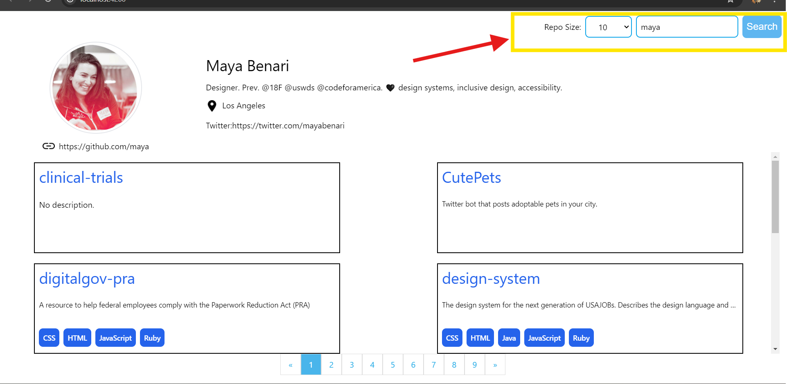
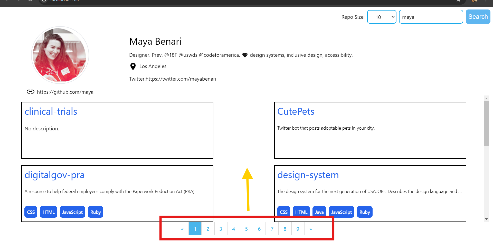

#Description

This is a simple Angular application that allows users to search for GitHub users and view their profiles. It utilizes the GitHub API to fetch user data and display it in a profile and public repositories.you can filter number of repos per page by selecting repos size,
pagination allows us to move to next list of repos according to the repos size.


#Features

Search for GitHub users by username
View detailed user profiles including their repositories, location, Name, bio and profile image.
Responsive design for mobile and desktop devices.


#Technologies Used

Angular
TypeScript
HTML/CSS
Tailwind


#Installation

1.Clone the repository:

bash
Copy code
```
git clone https://github.com/manish7041/fyle-internship-challenge-23.git
```

2.Navigate into the project directory:

3.Install dependencies:
```
npm install
```


#Usage
genrate your own GitHub account Access Token and than add it to interceptor file `send-token.interceptor.ts`
as in genral way it allows only limited rate limits. by use of token we get 5000 rate per/hr.
const accessToken = '';

Start the development server:
```
npm start
```

Open your web browser and navigate to `http://localhost:4200`

Enter a GitHub username in the search bar and press Enter and also you can choose size of repositories to vies per page by selection repos size dropdown.
View the user profile and related information.
View the repositories.

#Screenshots
;
;



